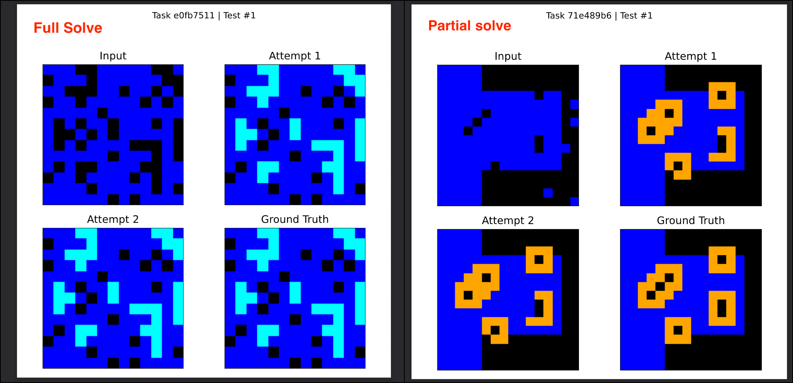

# How Far Can Vanilla NCAs Go on ARC-AGI?
Surprisingly far.

I benchmarked unmodified Neural Cellular Automata (NCAs) on all public tasks from ARC-AGI-1 and ARC-AGI-2 — train and eval. No modifications, no attention, just fixed-step vanilla NCAs.  And they hold up.

Oh also, its dirt cheap.

| Dataset | Tasks | Almost Solved (>=95% pixel accuracy) | Full Solves | 
|---------|-------------|---------------|---------------|
| Public Train (ARC-AGI-1) | 400 | 52 (13%) | 21 (5.25%) |
| Public Eval (ARC-AGI-1) | 400 | 46 (11%) | 9 (2.25%) |
| Public Train (ARC-AGI-2) | 1000 | 120 (12%) | 27 (2.7%) |
| Public Eval (ARC-AGI-2) | 120 | 6 (5%) | 0 |

## Context
A week ago, a team of researchers (Guichard et. al.) independently working on NCAs [posted](https://etimush.github.io/ARC_NCA/) their [results](https://arxiv.org/abs/2505.08778) on the public train set of ARC-AGI-1. They made great progress and showed results with both vanilla and engram NCAs, with the modified NCA outperforming the original one. They mainly tested on the 262 tasks (out of 400) with the same input and output grid size.

During the past couple of months, I had run a bunch of tests on ARC-AGI-2 and got vanilla NCAs to perform on par with a few of its modified cousins available in the literature. After seeing Guichard et. al.'s results, I decided to benchmark vanilla NCAs on all tasks of both ARC-1 and ARC-2, and they performed surprisingly well! Differing grid sizes aren't a problem either.

As of now, I am aware of 3 teams that have been independently working on ARC-AGI using NCAs for the past few months ([@kyuuxu](https://x.com/xuukyu/status/1894302541216686445), Stefano's team ([Guichard et. al.](https://arxiv.org/abs/2505.08778)), and me). I hope this invites more people to work on NCAs!

### How is this different?
- I am using vanilla NCAs with a fixed number of update steps.  
- I have benchmarked on all tasks regardless of differing grid sizes.
- I have benchmarked on all datasets of both ARC-AGI-2 and ARC-AGI-1.
- I believe they can perform on par with EngramNCAs and other modified cousins at a lower cost.  This doesn't prove it 100% yet, but I'm confident I will be able to do so in the next few weeks.

## What's next?
1) **Reliability**: These results are from a single run. On different runs, some of the 95% tasks were fully solved and vice versa (the overall accuracy is about the same).  
2) **Performance**: I have also made some minor changes internally that seem to improve the performance. I will keep posting updated results (along with the code) as I run more benchmarks.  
3) **Better Benchmarking**: I'll run Guichard et. al.'s code to do a more thorough benchmark and comparison.

## Details
Check the results folder for a full breakdown  
Don't forget to check the visualisations folder too!
