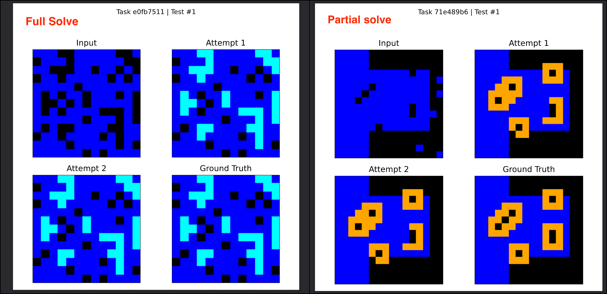

# How Far Can Vanilla NCAs Go on ARC-AGI?
Surprisingly far.

I benchmarked unmodified Neural Cellular Automata (NCAs) on all public tasks from ARC-AGI-1 and ARC-AGI-2 — train and eval. No modifications, no attention, just fixed-step vanilla NCAs.  

And they hold up.

Oh also, its dirt cheap.

| Dataset | Tasks | Full Solves | Almost Solved (>=95% pixel accuracy) |
|---------|-------------|---------------|---------------|
| Public Train (ARC-AGI-1) | 400 | 21 | 52 |
| Public Eval (ARC-AGI-1) | 400 | 9 | 46 |
| Public Train (ARC-AGI-2) | 1000 | 27 | 120 |
| Public Eval (ARC-AGI-2) | 120 | 0 | 6 |

## Background
A week ago, a team of researchers (Guichard et. al.) independently working on NCAs [posted](https://etimush.github.io/ARC_NCA/) their [results](https://arxiv.org/abs/2505.08778) on the public train set of ARC-AGI-1. They made great progress and showed results with both vanilla and engram NCAs, with the modified NCA outperforming the original one. They mainly tested on the 262 tasks (out of 400) with the same input and output grid size.

During the past couple of months, I had run a bunch of tests on ARC-AGI-2 and got vanilla NCAs to perform on par with a few of its modified cousins available in the literature. After seeing Guichard et. al.'s results, I decided to benchmark vanilla NCAs on all tasks of both ARC-1 and ARC-2, and they performed surprisingly well! Differing grid sizes also don't seem to be a problem.

Note that this is a single run. On multiple runs, some of the "almost solved" tasks become 100% correct (reliabiity is a problem that needs to be solved). I have also made some minor changes internally that seem to improve the performance. I will post updated results (along with the code) once I do.

As of now, I am aware of 3 teams that have been independently working on ARC-AGI using NCAs for the past few months ([@kyuuxu](https://x.com/xuukyu/status/1894302541216686445), Stefano's team ([Guichard et. al.](https://arxiv.org/abs/2505.08778)), and me). I hope this invites more people to work on NCAs!

### How is this different?
- I am using vanilla NCAs with a fixed number of update steps.  
- I am training on all tasks regardless of differing grid sizes.
- I believe they can perform on par with EngramNCAs and other modified cousins at a lower cost.  
- I have tested on all datasets of ARC-AGI-2 and ARC-AGI-1.  

## Details
Check the results folder for a full breakdown  
Don't forget to check the visualisations folder too!
